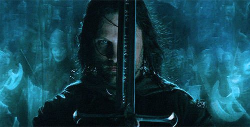

# Suilad Mellon :leaves:
> “It is not despair, for despair is only for those who see the end beyond all doubt. We do not.” - Gandalf the Grey

I always believe that knowledge should be shared equitably for all.  
Following are some *"fun"* facts for everyone to get to know me. I am:  
- **A student** :child: . I’m a foreign student who came to France to pursue my Bachelor's in Computer Science. I strongly believe we can do more than we think we can, if we are willing to do it and that everyone should be given a chance to develop and prove themselves. I’m always ready to study and currently seeking an internship in a dynamic company in the field of Data Science and Machine Learning. 
- **A late tech junkie** :mechanical_arm: . I realized how fascinating technology is to me at the age of 18 right when I was in the training class of Data Science. As many ideas start to circulate in my head with a small amount of knowledge from a junior, I know what I need to do and what I can do in the future if I am ready to dive into it. 
- Most importantly, **a Vietnamese girl** :vietnam: . I am proud to be a Vietnamese girl and to show the world how amazing my country is, what we can do, and who we are.

Thank you for visiting my gitgit guys :smiley_cat: :wave:  
